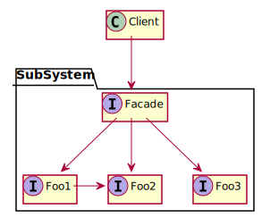
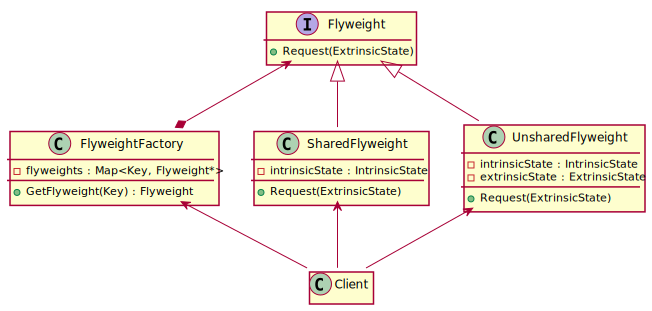
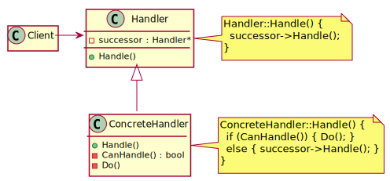
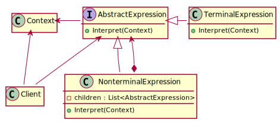
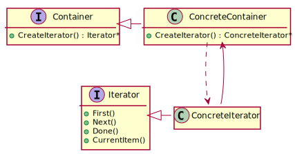

# Design Patterns

## Creational Patterns

### Abstract Factory
> Provide an interface for creating families of related or dependent objects without specifying their concrete classes.

[](./abstract_factory/README.md)

### Builder
> Separate the construction of a complex object from its representation so that the same construction process can create different representations.

[](./builder/README.md)

### Factory Method
> Define an interface for creating an object, but let subclasses decide which class to instantiate.

[](./factory_method/README.md)

### Prototype
> Specify the kinds of objects to create using a prototypical instance, and create new objects by copying this prototype.

[](./prototype/README.md)

### Singleton
> Ensure a class only has one instance, and provide a global point of access to it.

[](./singleton/README.md)

## Structural Patterns

### Adapter
> Convert the interface of a class into another interface clients expect.

[](./adapter/README.md)

### Bridge
> Decouple an abstraction from its implementation so that the two can vary independently.

[](./bridge/README.md)

### Composite
> Compose objects into tree structures to represent part-whole hierarchies.
> Composite lets clients treat individual objects and compositions of objects uniformly.

[](./composite/README.md)

### Decorator
> Attach additional responsibilities to an object dynamically.
> Decorators provide a flexible alternative to subclassing for extending functionality.

[](./decorator/README.md)

### Facade
> Provide a unified interface to a set of interfaces in a subsystem.
> Facade defines a higher-level interface that makes the subsystem easier to use.

[](./facade/README.md)

### Flyweight
> Use sharing to support large numbers of fine-grained objects efficiently.

[](./flyweight/README.md)

### Proxy
> Provide a surrogate or placeholder for another object to control access to it.

[](./proxy/README.md)

## Behavioral Patterns

### Chain of Responsibility
> Avoid coupling the sender of a request to its receiver by giving more than one object a chance to handle the request.
> Chain the receiving objects and pass the request along the chain until an object handles it.

[](./chain_of_responsibility/README.md)

### Command
> Encapsulate a request as an object, thereby letting you parameterize clients with different requests, queue or log requests, and support undoable operations.

[](./command/README.md)

### [Interpreter](./Interpreter/README.md)


### [Iterator](./Iterator/README.md)


### [Mediator](./Mediator/README.md)


### [Memento](./Memento/README.md)


### Observer
> Define a one-to-many dependency between objects so that when one object changes state, all its dependents are notified and updated automatically.

[](./observer/README.md)

### [State](./State/README.md)


### [Strategy](./Strategy/README.md)


### [Template Method](./TemplateMethod/README.md)


### [Visitor](./Visitor/README.md)


## Language Support

### Java

#### `implements` an `interface`

```java
public interface Comparable<T> {
  public abstract int compareTo(T that);
}

public class Point implements Comparable<Point> {
  private final double x;
  private final double y;
  
  public Point(double x, double y) {
    this.x = x;
    this.y = y;
  }
  
  @Override
  public int compareTo(Point that) {
    if (this.x < that.x) return -1;
    if (this.x > that.x) return +1;
    if (this.y < that.y) return -1;
    if (this.y > that.y) return +1;
    return 0;
  }
}
```

#### `extends` a `class`

所有用 `class` 定义的类都是 [`java.lang.Object`](https://docs.oracle.com/javase/8/docs/api/java/lang/Object.html) 的 <子类::subclass> (或 <派生类::derived classs>).

```java
public class Object {
  public String toString();
}

public class Point extends Object {
  private final double x;
  private final double y;
  
  public Point(double x, double y) {
    this.x = x;
    this.y = y;
  }
  
  @Override
  public String toString() {
    StringBuilder sb = new StringBuilder();
    sb.append('(');
    sb.append(this.x);
    sb.append(',').append(' ');
    sb.append(this.y);
    sb.append(')');
    return sb.toString();
  }
  
  // extended methods
  // ...
}
```

### C++

#### Inheritance

```c++
#include <iostream>
#include <string>

class Object {
 public:
  virtual std::string to_string() = 0;
};

class Point : public Object {
 private:
  const double _x;
  const double _y;
  
 public:
  Point(double x, double y) : _x(x), _y(y) { }
  virtual std::string to_string() override {
    return '(' + std::to_string(_x) + ',' + ' ' + std::to_string(_y) + ')';
  }
};

int main() {
  Point p = Point(1.0, 0.0);
  std::cout << p.to_string() << std::endl;
}
```

#### Inheritance + `template`

```cpp
#include <iostream>

template<class T>
class Comparable {
  virtual int compareTo(const T& that) = 0;
};

class Point : public Comparable<Point> {
 private:
  const double _x;
  const double _y;
  
 public:
  Point(double x, double y) : _x(x), _y(y) { }
  virtual int compareTo(const Point& that) override {
    if (_x < that._x) return -1;
    if (_x > that._x) return +1;
    if (_y < that._y) return -1;
    if (_y > that._y) return +1;
    return 0;
  }
};

int main() {
  using P = Point;
  P o = P(0.0, 0.0);
  P p = P(1.0, 0.0);
  std::cout << p.compareTo(o) << std::endl;
}
```
