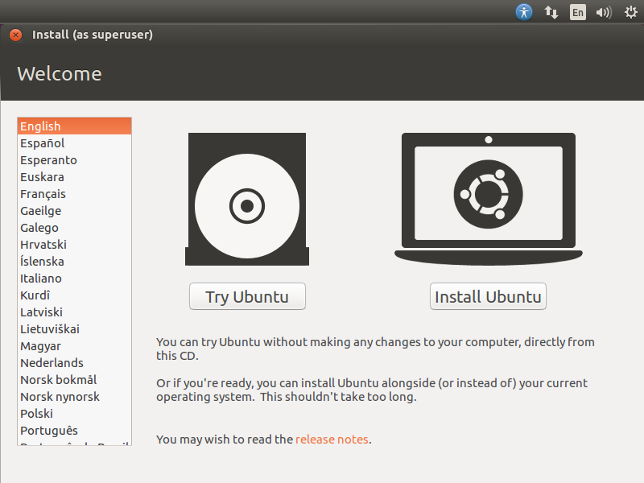
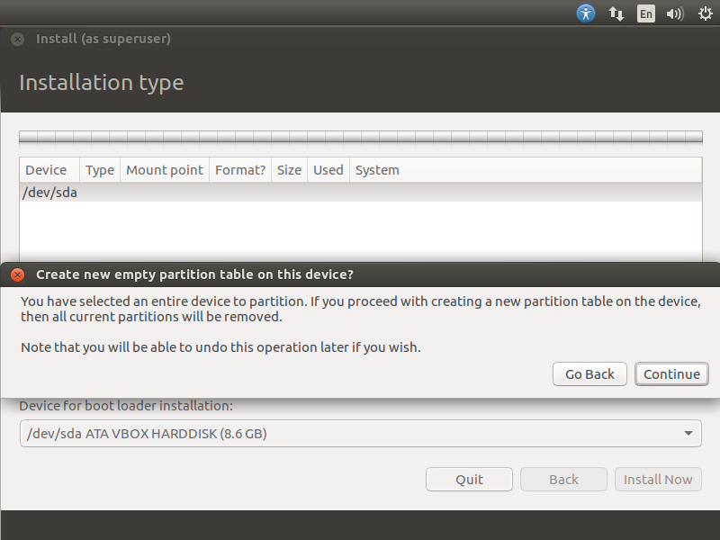
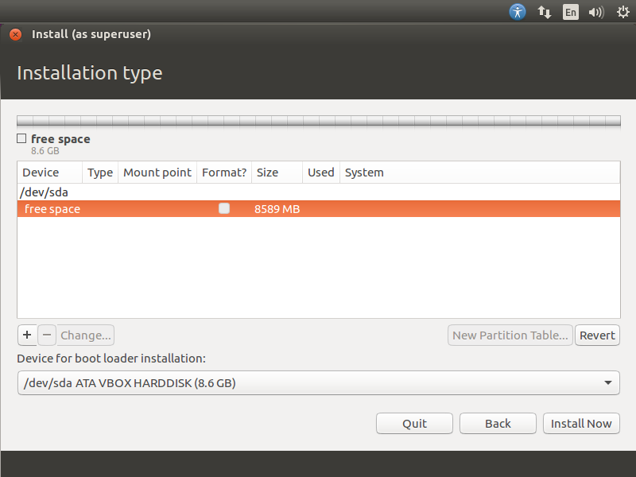
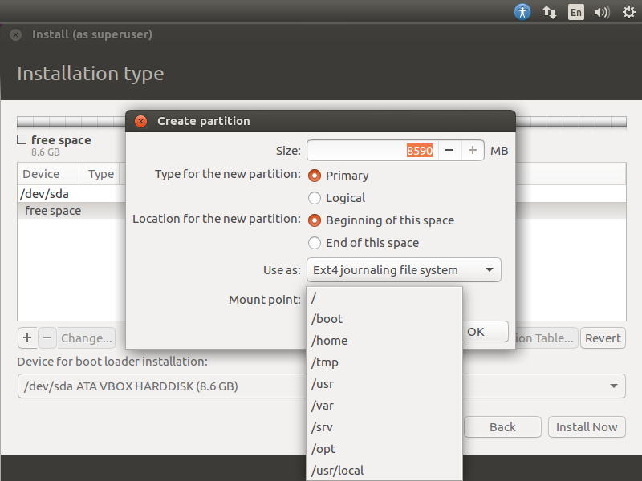
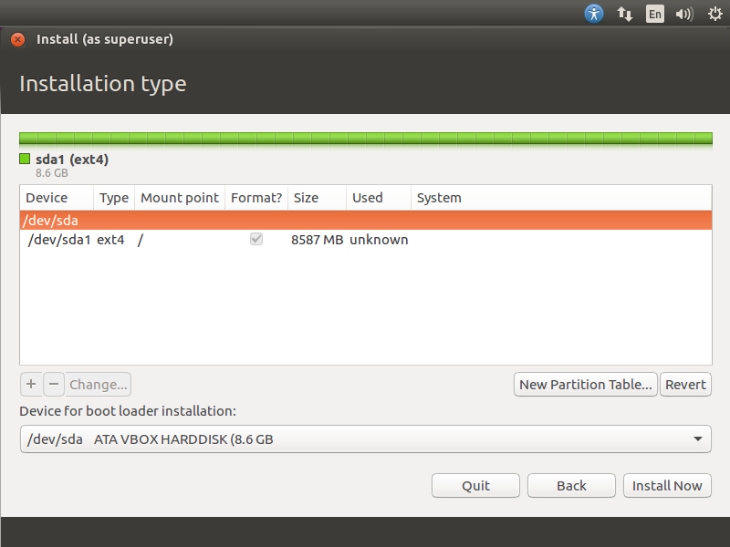
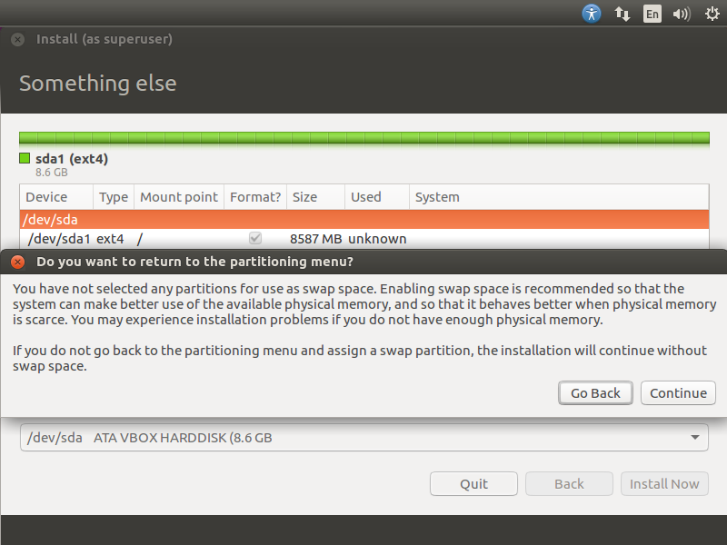
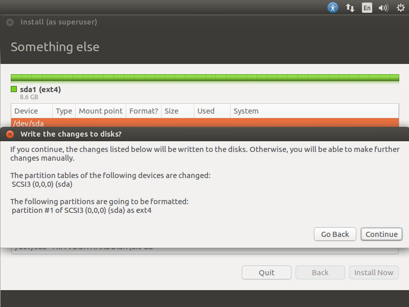
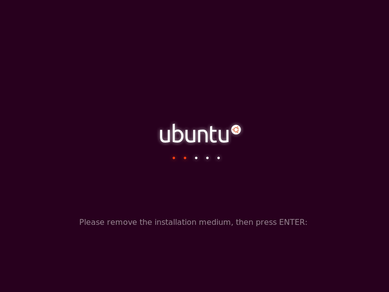

# 安装 Linux 发行版

本文是写给 Linux 新手的快速安装指南.

## 获取 Linux 发行版

所谓 Linux **发行版 (distribution)** 是指基于 Linux **内核 (kernel)** 并添加了一些常用自由/开源软件而开发的**类 Unix (Unix-like)** 操作系统, 例如 [Debian](https://www.debian.org), [Ubuntu](https://www.ubuntu.com), [CentOS](https://www.centos.org/), [Fedora](https://getfedora.org) 等. 对于新手而言, 不必过于纠结选择哪一种发行版, 因为它们的基本操作是一样的, 而只在个别细节 (例如软件包管理工具) 上会有差异.

本文以 [Ubuntu 16.04](http://releases.ubuntu.com/xenial/) 为例, 演示如何在本地主机上安装 Linux 发行版, 请先下载其[桌面版](https://www.ubuntu.com/download/desktop)或[服务器版](https://www.ubuntu.com/download/server)的镜像 (`.iso`) 文件. 桌面版更侧重于个人应用, 而服务器版更侧重于系统服务, 因此默认安装的软件会有不同.

## 制作可启动设备

获取镜像文件后, 首先用它来制作安装介质, 即**可启动 (bootable)** 光盘或 U 盘. 制作安装介质, 并不是简单的把镜像文件中的内容复制到光盘或 U 盘中, 而是需要利用刻录软件将其写入, 具体方法如下. 

### 制作可启动 U 盘

准备一块容量足够大的 U 盘, 推荐 USB 3.0 及以上的款式以保证速度, 然后根据你所使用的操作系统, 查阅相应的指南完成操作:

- [How to create a bootable USB stick on Ubuntu](https://www.ubuntu.com/download/desktop/create-a-usb-stick-on-ubuntu)
- [How to create a bootable USB stick on Windows](https://www.ubuntu.com/download/desktop/create-a-usb-stick-on-windows)
- [How to create a bootable USB stick on OS X](https://www.ubuntu.com/download/desktop/create-a-usb-stick-on-mac-osx)

## 从指定设备启动

一台计算机上可能连接了多个可启动设备, 例如:

- 可启动光盘或 U 盘
- 装有操作系统的磁盘
- 网络驱动器

计算机接通电源后, 首先进入主板上的 **BIOS (Basic Input Output System)**, 其工作方式如下:

- 检查连接到这台计算机的硬件设备.
- 根据**启动项列表**中的顺序, 依次尝试加载各可启动设备.
- 一旦加载成功, 控制权就移交给该设备, 否则尝试下一个可启动设备.
- 若所有可启动设备都不能被正常加载, 则报错.

所谓**安装**操作系统, 就是指将安装介质中的操作系统文件, 写入到目标磁盘上, 以便在下一次开机时可以从该磁盘启动. 因此, 我们需要在 BIOS 中将准备好的可启动光盘或 U 盘调整为第一个可以被加载的设备. 

不同品牌的计算机进入 BIOS 的方式略有不同, 但一般都会在显示厂家信息后给出提示 (除非等待时间被设定为 0 秒). 一种偷懒的方式是: 在开机后不停地按 `[Del]` 或 `[F2]` 或 `[F12]`, 直到进入 BIOS 设置页面; 若不成功则重启并尝试另一个键.

## 磁盘分区及挂载目录

从准备好的光盘或 U 盘启动, 进入以下页面:



选择 `Install Ubuntu`, 然后一路默认, 直到进入以下页面:


选择 `Something else` 并单击 `Continue`, 表示要手动进行磁盘分区和挂载目录. 如果目标计算机上只有一块磁盘并且没有被分区,  那么将会进入以下页面:


如果在 `/dev/sda` 下还有其他磁盘, 比如 `/dev/sdb` 及 `/dev/sdc`, 则需先选中 (单击) 其中一个作为目标磁盘. 这里假设选中的是  `/dev/sda`, 单击 `New Partition Table`, 将会弹出警告信息:



单击 `Continue` 以确认可以删除 (但不会立即删除) 所有已经存在的分区, 然后单击 `free space` 使其背景变为橙色:



然后单击左下角的 `+`, 弹出一个 `Create partition` 对话框:



可修改项包括: 大小/类型/位置/格式/挂载点, 其中最重要的是挂载点的选择. 为了理解分区与挂载点的关系, 我们可以把整块磁盘想象成一个巨大的数组 `a[0:1000)`. 一个分区就相当于一个子数组, 比如 `a[100:200)`, `a[300:400)` 等, 只要它们相互之间没有重叠就行. 挂载点表示这些子数组在文件系统中所对应的目录, 比如 `/`, `/home`, `/usr` 等. 

最简单的分区和挂载方案是: 只创建一个分区, 然后将 Linux 文件系统的总根目录 `/` 设为挂载点.

稍微复杂一点的方案是: 创建多个分区, 然后将 `/` (必选) 及其他目录 (可选一个或多个) 设为挂载点. 逻辑上, 所有其他目录都是 `/` 的子目录; 物理上, 凡是被设为了挂载点的目录 (及其子没有被设为挂载点的子目录) 都位于其对于分区中, 因而都位于 `/` 所对应的分区外.

到底采用哪种分区方案, 取决于使用场景对性能的要求. 一个典型的例子是: 假设有一个非常大 (比如 `100 GB`) 的文件 `bigfile` 需要从 `/foo` 目录**移动**到 `/bar` 目录下, 可以在 Shell 中执行以下命令:

```shell
mv /foo/bigfile /bar
```

该命令的执行效率取决于 `/foo` 和 `/bar` 是否在同一个分区 (子数组) 中:

- 如果是, 那么移动操作只需要修改一个引用, 瞬间就可以完成.
- 如果不是, 那么移动操作就需要对该文件的每个字节进行读写操作, 可能需要花费几个小时才能完成.

如果对分区和挂载方案不满意, 可以反复利用 `-`/`+` 进行调整. 最终确认无误后, 单击 `Install Now`:



如果在分区表中没有设置 `swap` 空间, 将会弹出警告信息:



这是 Linux 的一种在内存与磁盘之间作缓存的机制, 用以缓解内存不够的问题. 现在计算机的内存都很大了, 所以一般不需要设置 `swap` 空间. 单击 `Continue`, 弹出确认对话框:



在单击 `Continue` 确认以前, 分区和挂载方案都不会被写入磁盘. 因此, 这是整个分区和挂载操作最关键的一步, 一定要确保磁盘中的数据可以丢弃或者已经备份过了.

## 设置用户名和密码

在完成分区和挂载操作后, 安装程序就开始将安装介质中的系统文件写入到目标磁盘里. 在此过程中, 安装程序会让安装者设置一些信息, 一路默认就可以了, 直到进入用户名和密码的设置页面:


其中最关键的是 `username` 和 `password` 的设置. 在 Linux 中, 有超级权限用户 (`root`) 和普通权限用户之分. 因此, 大多数发行版在安装过程中, 会要求安装者设置两次密码:

- 第一次的用户名已经被设置为 `root`, 安装者只需要设置其密码 (一定要牢记).
- 第二次则是为普通用户设置用户名和密码 (可以由 `root` 修改).

但是 Ubuntu 在安装和使用过程中并不会直接出现 `root` 这个用户名 (但这个用户的确是存在的), 而是只需要设置一次用户名和密码, 并且赋予这个用户超级权限和普通权限两重身份.

设置完成后, 只需要等待安装程序提示重启. 为了避免重启时再次加载安装介质, 应当在适当的时候 (例如提示可以安全移除安装介质或断电后) 移除安装介质:



## 首次启动后的设置

为了让装好的系统用得舒服, 一般会在首次启动后做如下设置.

### 修改密码
修改当前用户的密码:
```shell
passwd
```

### 安装 Vim

[Vim](../Vim.md) 是 Linux 系统下常用的一款 CLI 文本编辑器. 打开终端 (`[Ctrl] + [Alt] + T`) 并尝试以下命令:

```shell
vim --version
```

如果提示没有安装, 可以通过以下命令下载并安装:

```shell
sudo apt install vim
```

其中 `apt` 是 Debian/Ubuntu 下的软件包管理命令. 在 CentOS/Fedora 下对应的命令为 `yum`.

### 调整终端配置

Ubuntu 默认的终端提示格式为

```
username@hostname:~$ 
```

其中 `username@hostname` 是同一种颜色. 为了更方便地区分 `username` 与 `hostname`, 可以在终端设置文件 (如 `~/.bashrc`) 中修改颜色及格式设置. 

在所有 Linux 发行版下, 都可以用 Vim 来修改:

```shell
vim ~/.bashrc
```

对于不熟悉 Vim 的新手, 可以用任何一款 GUI 文本编辑器进行修改. 例如在 Ubuntu 中, 可以用 [gedit](http://www.gedit.org) 代替 Vim:

```shell
gedit ~/.bashrc
```

找到以下内容
```shell
if [ "$color_prompt" = yes ]; then
    PS1='${debian_chroot:+($debian_chroot)}\[\033[01;32m\]\u@\h\[\033[00m\]:\[\033[01;34m\]\w\[\033[00m\]\$ '
else
    PS1='${debian_chroot:+($debian_chroot)}\u@\h:\w\$ '
fi
```

将其修改为

```shell
if [ "$color_prompt" = yes ]; then
    PS1='\[\033[34m\]\u\[\033[00m\]@\[\033[31m\]\h\[\033[00m\]:\[\033[32m\]\w\[\033[00m\]\n\$ '
else
    PS1='${debian_chroot:+($debian_chroot)}\u@\h:\w\$ '
fi
```

在 `~/.bashrc` 文件中, 另一个建议修改的地方是:

```shell
# -a 选项会显示隐藏文件的信息, 日常使用中是多余的:
alias ll='ls -alF'
# 建议修改为:
alias ll='ls -lF'
```

保存并退出, 然后用 `source` 命令使其生效 (或重启终端):

```shell
source ~/.bashrc
```
